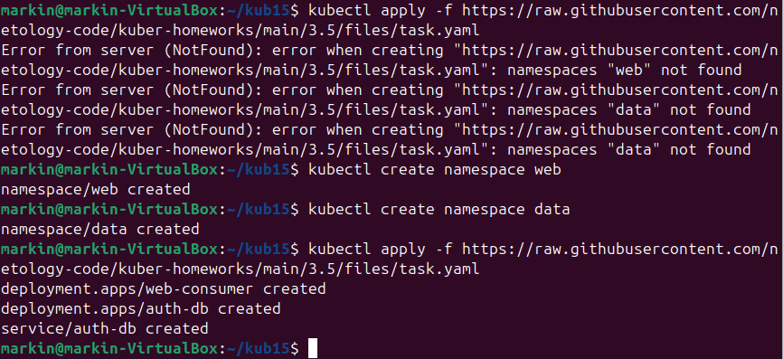
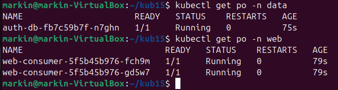
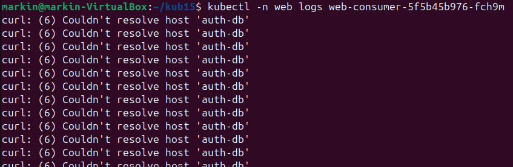
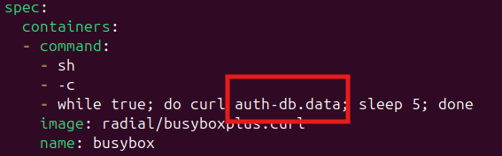
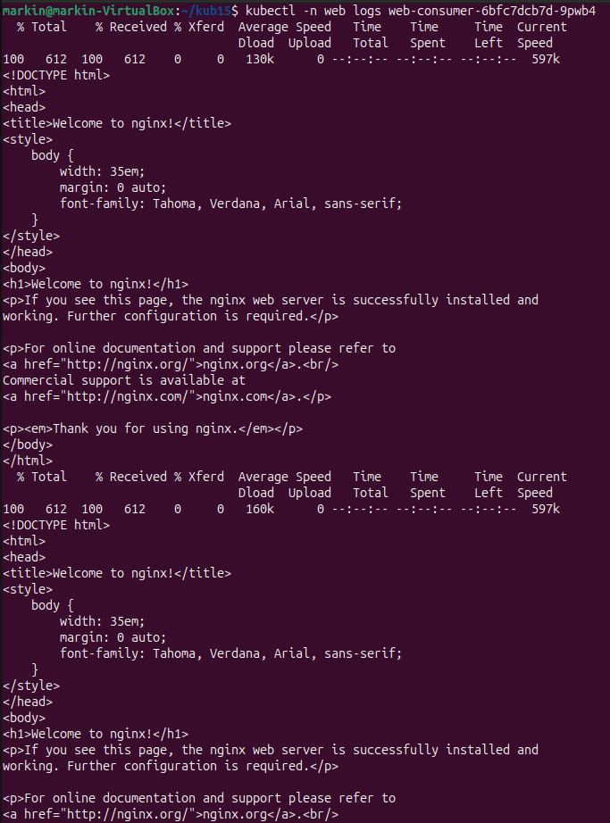

# Домашнее задание к занятию "`Обновление приложений`" - `Маркин Алексей`

### Цель задания

Устранить неисправности при деплое приложения.

### Задание. При деплое приложение web-consumer не может подключиться к auth-db. Необходимо это исправить

1. Установить приложение по команде:
```shell
kubectl apply -f https://raw.githubusercontent.com/netology-code/kuber-homeworks/main/3.5/files/task.yaml
```
2. Выявить проблему и описать.
3. Исправить проблему, описать, что сделано.
4. Продемонстрировать, что проблема решена.


### Решение

Прервая ошибка это отсутствующие namespac'ы, которые необходимо создать.



Проверяем, что контейнеры запустились



Проверив логи контейнеров обнаруживаем что приложение в web-consumer не может разршить имя auth-db. 



Так как приложения находятся в разных namespac'ах необходимо в файле [task.yaml](./task.yaml) добавить к dns записи название необходимого namespace.



После редиплоя проверяем логи контейнера web и убежаемся в работоспособности.



### Правила приёма работы

1. Домашняя работа оформляется в своём Git-репозитории в файле README.md. Выполненное домашнее задание пришлите ссылкой на .md-файл в вашем репозитории.
2. Файл README.md должен содержать скриншоты вывода необходимых команд, а также скриншоты результатов.
3. Репозиторий должен содержать тексты манифестов или ссылки на них в файле README.md.